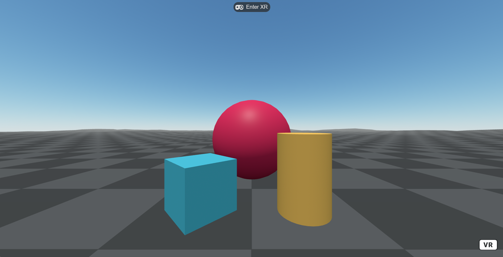

# 😎 Hello XR - <a href="https://foobar404.github.io/webxr-sdk/">Demo</a>
[](https://www.npmjs.com/package/create-xr) [](https://opensource.org/licenses/MIT) [](https://www.npmjs.com/package/create-xr)

This repository is meant to be an *easy to use* starter kit of the best / most current 3D and XR libraries on the web, with some of my own contributions as well. Packages such as **AFRAME**, **THREE.js**, the **IWSDK** by Meta, and a few others, all bundled using **Vite**, with a simple `npm create xr` command to generate a template project with all the functionality you would expect from a *modern day game engine*, like physics, locomotion, controller/hand tracking, skyboxes, gltf model rendering, scene editor, XR emulator, and many more. 

<a href="https://foobar404.github.io/webxr-sdk/" target="_blank"></a>

# Getting Started
Get up and running with web xr development with just a few commands!

## Template
To create a new Web XR project using the template, use:
```
npm create xr
```
to run the project use:
```
npm run dev
```

## Components
To import all **AFRAME** components into your project (done automatically when using the template), use:
```
<script src="https://cdn.skypack.dev/pin/gh@v2.8.9-pbIyFCSRoTBr23wffpcU/mode=raw,min/foobar404/webxr-sdk@main/components/index.js"></script>
```
To import individual components into your **AFRAME** project use:
```
<script src="https://cdn.jsdelivr.net/gh/foobar404/webxr-sdk@main/components/component.js"></script>
```
Replace `component` with your desired component, for example the **fly** component would be:
```
<script src="https://cdn.jsdelivr.net/gh/foobar404/webxr-sdk@main/components/fly.js"></script>
```

# Components
**AFRAME.js** provides the scaffolding to build a powerful XR app, such as **geometry**, **materials** / **textures**, gltf model rendering, **animations**, and more. This project aims to fill the gaps and create a *cohesive development experience*, *similar* to a modern game development workflow that one would have with **Unity** or **Unreal**. *Crucial* missing features for quick **webxr** development include things like **locomotion**, VR UI for things like menus, basic object interactions, **performance** optimization such as model compression, LOD controls, foveated rendering, and many other components one would expect that have for a streamlined XR development workflow.

## Current Components
- **bullet**: Manages bullet projectiles with *collision detection*, *pooling*, and *target interaction*
- **confetti**: Creates a *confetti effect* with falling particles in waves
- **decal**: Adds *decals* (stickers) to surfaces at specified points with *texture support*
- **fly**: Provides *flying movement controls* using VR controllers with joystick, trigger, and grip inputs
- **gravity**: Applies *gravity* and *damping* to rigid bodies with basic collision detection
- **haptics**: Enables *haptic feedback* (vibration) for VR controllers with pulse and burst modes
- **jump**: Implements *jumping mechanics* for entities
- **origin**: Sets the *origin* or reset position for the scene
- **passthrough-toggle**: Toggles AR *passthrough mode* for mixed reality experiences
- **phone-controls**: Provides controls optimized for *mobile phone input*
- **rigid-body**: Defines *physics rigid bodies* with velocity and collision properties
- **shooter**: Handles *shooting mechanics* and projectile spawning
- **smooth-move**: Enables *smooth movement controls* for locomotion
- **smooth-turn**: Provides *smooth turning controls* for camera rotation
- **snap-turn**: Implements *snap turning* for VR locomotion
- **static-body**: Defines *static physics bodies* that don't move but can collide
- **super-keyboard**: *Enhanced keyboard controls* with additional features
- **target**: Creates *interactive targets* for shooting or other interactions
- **vignette**: Applies a *vignette visual effect* to the scene
- **wasd-plus**: WASD movement controls with *additional locomotion features*
- **world-grab**: Allows *grabbing and manipulating* objects in the world

# References
To take full advantage of the project it's *necessary* to understand the basics of **aframe.js**, and **THREE.js** to some degree, so here are some links to *important resources*.

- **AFRAME** - https://aframe.io/docs/master/introduction/
- **THREE.js** - https://threejs.org/manual/#en/installation
- **IWSDK** - https://developers.meta.com/horizon/documentation/web/iwsdk-overview

# License
This project is licensed under the MIT License - see the [LICENSE](LICENSE) file for details.

